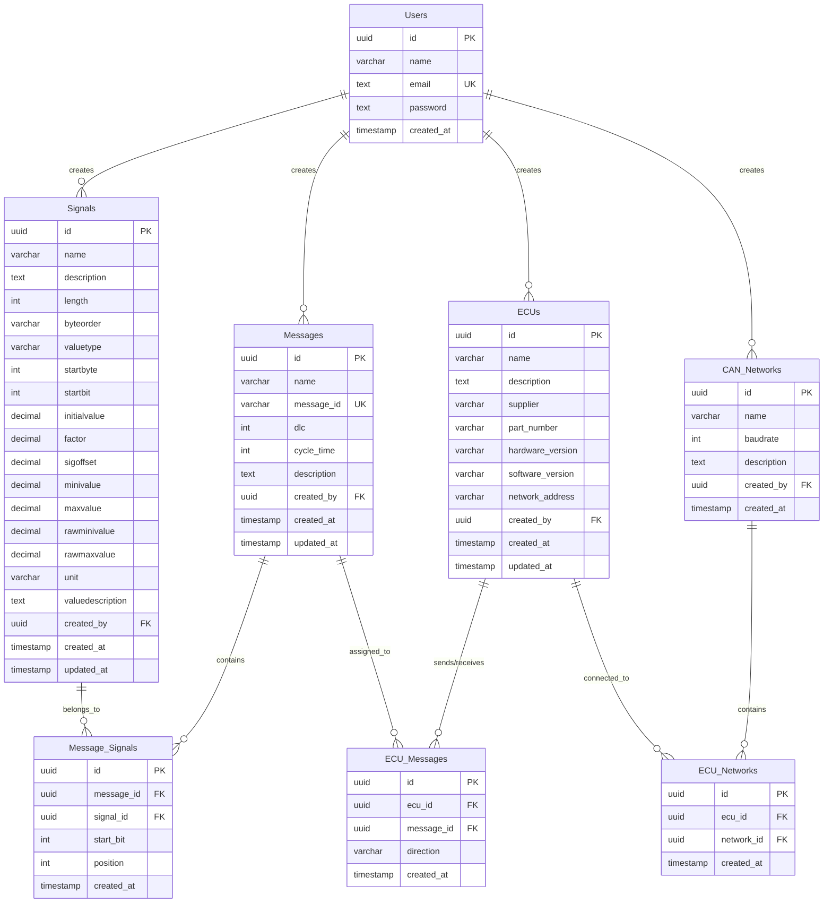

# Vehicle Signal Management Platform

A comprehensive CAN signal management platform designed to streamline automotive EEA (Electrical/Electronic Architecture) development. This platform enables multiple users to create, manage, and organize CAN signals, messages, and ECU configurations with full CRUD operations and database persistence.

## 🚗 Project Overview

### Purpose
This platform addresses the complex needs of automotive engineers and system designers working with vehicle E/E architecture by providing:
- Structured signal management with comprehensive metadata
- Message composition from individual signals
- ECU mapping and network visualization
- Multi-user collaboration with authentication
- Data export capabilities for integration with other tools

### Target Users
- Automotive engineers
- System designers
- Developers involved in vehicle E/E architecture development
- CAN network designers

## 🏗️ System Architecture

### Technology Stack

**Frontend:**
- React 19.0.0
- Next.js 14 (with App Router)
- TypeScript 5.7.2
- Tailwind CSS 3.4.16
- React DnD 16.0.1 (for drag-and-drop functionality)

**Backend:**
- Next.js API Routes
- PostgreSQL via `@vercel/postgres`
- Server-side rendering (SSR)

**Authentication:**
- NextAuth.js 5.0.0-beta.19
- Bcrypt 5.1.1 for password hashing

**Utilities:**
- Zod 3.23.8 for schema validation
- clsx 2.1.1 for conditional styling

### Architecture Pattern
- **MVC Pattern**: Clear separation of Model (database), View (UI components), and Controller (API routes)
- **Server Components**: Optimized rendering with Next.js App Router
- **RESTful API**: Clean API endpoints for data operations
- **Middleware-based Authentication**: Secure route protection

## 📊 Database Design

### Database Choice: PostgreSQL

**Why PostgreSQL:**
- **Relational Data Support**: Perfect for CAN signal hierarchical relationships
- **Data Integrity**: ACID compliance ensures data consistency critical for automotive applications
- **Complex Queries**: Advanced SQL features for signal analysis
- **JSON Support**: Flexible storage for signal metadata
- **Scalability**: Handles large datasets efficiently
- **Transaction Support**: Ensures atomic operations

### Core Database Structure

#### 1. **Signals** (`signals`)
Stores individual CAN signal definitions with comprehensive metadata:
```sql
CREATE TABLE signals (
  id UUID PRIMARY KEY DEFAULT uuid_generate_v4(),
  name VARCHAR(255) NOT NULL,
  description TEXT,
  length INTEGER NOT NULL,                -- Signal length in bits
  byteorder VARCHAR(50) NOT NULL,         -- 'big_endian' or 'little_endian'
  valuetype VARCHAR(50) NOT NULL,         -- 'unsigned', 'signed', 'float', 'double'
  startbyte INTEGER,                      -- Starting byte position
  startbit INTEGER,                       -- Starting bit position
  initialvalue DECIMAL,                   -- Default value
  factor DECIMAL DEFAULT 1,              -- Scaling factor
  sigoffset DECIMAL DEFAULT 0,           -- Offset value
  minivalue DECIMAL,                     -- Minimum physical value
  maxvalue DECIMAL,                      -- Maximum physical value
  rawminivalue DECIMAL,                  -- Minimum raw value
  rawmaxvalue DECIMAL,                   -- Maximum raw value
  unit VARCHAR(50),                      -- Physical unit (km/h, °C, etc.)
  valuedescription TEXT,                 -- Value description/enumeration
  created_by UUID REFERENCES users(id),
  created_at TIMESTAMP DEFAULT CURRENT_TIMESTAMP,
  updated_at TIMESTAMP DEFAULT CURRENT_TIMESTAMP
);
```

#### 2. **Messages** (`messages`)
Represents CAN messages that contain multiple signals:
```sql
CREATE TABLE messages (
  id UUID PRIMARY KEY DEFAULT uuid_generate_v4(),
  name VARCHAR(255) NOT NULL,
  message_id VARCHAR(50) NOT NULL UNIQUE, -- CAN ID (0x123 format)
  dlc INTEGER NOT NULL DEFAULT 8,         -- Data Length Code (1-8 bytes)
  cycle_time INTEGER,                     -- Message transmission cycle (ms)
  description TEXT,
  created_by UUID REFERENCES users(id),
  created_at TIMESTAMP DEFAULT CURRENT_TIMESTAMP,
  updated_at TIMESTAMP DEFAULT CURRENT_TIMESTAMP
);
```

#### 3. **Message-Signal Mapping** (`message_signals`)
Many-to-many relationship between messages and signals:
```sql
CREATE TABLE message_signals (
  id UUID PRIMARY KEY DEFAULT uuid_generate_v4(),
  message_id UUID REFERENCES messages(id) ON DELETE CASCADE,
  signal_id UUID REFERENCES signals(id) ON DELETE CASCADE,
  start_bit INTEGER NOT NULL,             -- Signal position in message
  position INTEGER NOT NULL,              -- Signal order in message
  created_at TIMESTAMP DEFAULT CURRENT_TIMESTAMP,
  UNIQUE(message_id, signal_id),
  UNIQUE(message_id, start_bit)
);
```

#### 4. **ECUs** (`ecus`)
Electronic Control Units that send/receive messages:
```sql
CREATE TABLE ecus (
  id UUID PRIMARY KEY DEFAULT uuid_generate_v4(),
  name VARCHAR(255) NOT NULL,
  description TEXT,
  supplier VARCHAR(255),
  part_number VARCHAR(255),
  hardware_version VARCHAR(100),
  software_version VARCHAR(100),
  network_address VARCHAR(50),            -- CAN node address
  created_by UUID REFERENCES users(id),
  created_at TIMESTAMP DEFAULT CURRENT_TIMESTAMP,
  updated_at TIMESTAMP DEFAULT CURRENT_TIMESTAMP
);
```

#### 5. **ECU-Message Mapping** (`ecu_messages`)
Defines which ECUs send or receive which messages:
```sql
CREATE TABLE ecu_messages (
  id UUID PRIMARY KEY DEFAULT uuid_generate_v4(),
  ecu_id UUID REFERENCES ecus(id) ON DELETE CASCADE,
  message_id UUID REFERENCES messages(id) ON DELETE CASCADE,
  direction VARCHAR(20) NOT NULL CHECK (direction IN ('send', 'receive')),
  created_at TIMESTAMP DEFAULT CURRENT_TIMESTAMP,
  UNIQUE(ecu_id, message_id, direction)
);
```

#### 6. **CAN Networks** (`can_networks`)
Supports multiple CAN networks:
```sql
CREATE TABLE can_networks (
  id UUID PRIMARY KEY DEFAULT uuid_generate_v4(),
  name VARCHAR(255) NOT NULL,
  baudrate INTEGER NOT NULL DEFAULT 500000, -- CAN baudrate
  description TEXT,
  created_by UUID REFERENCES users(id),
  created_at TIMESTAMP DEFAULT CURRENT_TIMESTAMP
);
```

#### 7. **Users** (`users`)
User management and authentication:
```sql
CREATE TABLE users (
  id UUID PRIMARY KEY DEFAULT uuid_generate_v4(),
  name VARCHAR(255) NOT NULL,
  email TEXT NOT NULL UNIQUE,
  password TEXT NOT NULL,
  created_at TIMESTAMP DEFAULT CURRENT_TIMESTAMP
);
```

### Data Relationships



**Key Relationships:**
- **Users** can create multiple signals, messages, ECUs, and networks (1:N)
- **Signals** can belong to multiple messages through message_signals junction table (N:M)
- **Messages** can contain multiple signals with specific positioning (N:M)
- **ECUs** can send and receive multiple messages through ecu_messages junction table (N:M)
- **CAN Networks** can contain multiple ECUs through ecu_networks junction table (N:M)
- **Foreign Keys** ensure data integrity and referential consistency
- **Junction Tables** handle many-to-many relationships efficiently

## 🖥️ User Interface Structure

### Page Organization

#### 1. **Signals Page** (`/dashboard/signals`)
- **Purpose**: Signal CRUD operations
- **Features**:
  - Create new signals with comprehensive metadata
  - View all signals in searchable table
  - Edit/update signal properties
  - Delete unused signals
  - Export signals to CSV/DBC format

#### 2. **Messages Page** (`/dashboard/messages`)
- **Purpose**: Message composition from signals
- **Features**:
  - Drag-and-drop signal assembly
  - Visual message layout (8-byte CAN frame)
  - Signal positioning and bit mapping
  - Message validation (DLC, bit conflicts)
  - Message library management

#### 3. **ECUs Page** (`/dashboard/ecus`)
- **Purpose**: ECU management and message mapping
- **Features**:
  - ECU configuration and metadata
  - Message send/receive assignments
  - Network topology visualization
  - ECU-to-ECU communication mapping
  - Hardware/software version tracking

#### 4. **Dashboard** (`/dashboard`)
- **Purpose**: System overview and analytics
- **Features**:
  - Signal count and statistics
  - Message utilization metrics
  - ECU network status
  - Recent activity feed

## 🚀 Getting Started

### Prerequisites
- Node.js 12+ 
- npm or yarn
- PostgreSQL database
- Git

### Installation

1. **Clone the repository**
   ```bash
   git clone [repository-url]
   cd vehicle_signal
   ```

2. **Install dependencies**
   ```bash
   npm install
   ```

3. **Set up environment variables**
   Create `.env.local` file:
   ```env
   POSTGRES_URL="your-postgres-connection-string"
   NEXTAUTH_SECRET="your-secret-key"
   NEXTAUTH_URL="http://localhost:3000"
   ```

4. **Initialize database**
   ```bash
   # Run database migrations and seed data
   npm run seed
   ```

5. **Start development server**
   ```bash
   npm run dev
   ```

6. **Access the application**
   Open [http://localhost:3000](http://localhost:3000) in your browser

### Build Commands

- **Development**: `npm run dev` - Start development server with hot reload
- **Build**: `npm run build` - Create production build
- **Start**: `npm run start` - Start production server
- **Seed**: `npm run seed` - Initialize database with sample data

## 📁 Project Structure

```
vehicle_signal/
├── app/
│   ├── api/                    # API routes
│   │   ├── signals/           # Signal CRUD endpoints
│   │   └── export/            # Data export endpoints
│   ├── dashboard/             # Main application pages
│   │   ├── signals/          # Signal management UI
│   │   ├── messages/         # Message composition UI
│   │   ├── ecus/            # ECU management UI
│   │   └── (overview)/      # Dashboard overview
│   ├── lib/                   # Business logic
│   │   ├── actions.ts        # Server actions
│   │   ├── data.ts           # Data fetching functions
│   │   ├── definitions.ts    # TypeScript type definitions
│   │   └── utils.ts          # Utility functions
│   ├── ui/                    # Reusable UI components
│   │   ├── signals/          # Signal-specific components
│   │   ├── messages/         # Message-specific components
│   │   ├── dashboard/        # Dashboard components
│   │   └── ...              # Common components
│   ├── login/                 # Authentication pages
│   └── seed/                  # Database seeding
├── auth.ts                    # Authentication configuration
├── middleware.ts              # Route protection
└── package.json              # Dependencies and scripts
```

## 🔧 Development Workflow

### Signal Development Flow
1. **Create Signal** → Define signal properties and validation rules
2. **Test Signal** → Validate signal format and ranges
3. **Assign to Message** → Add signal to CAN message with positioning
4. **Map to ECU** → Assign message send/receive to specific ECUs
5. **Export Configuration** → Generate DBC or other format files

### Message Development Flow
1. **Design Message** → Define CAN ID, DLC, and cycle time
2. **Add Signals** → Drag signals into message layout
3. **Validate Layout** → Check for bit conflicts and DLC compliance
4. **Assign ECUs** → Configure which ECUs send/receive the message
5. **Test Communication** → Validate ECU-to-ECU message flow

### ECU Development Flow
1. **Define ECU** → Set hardware/software specifications
2. **Assign Messages** → Configure send/receive message assignments
3. **Network Mapping** → Position ECU in CAN network topology
4. **Validate Configuration** → Check for address conflicts and load
5. **Generate Code** → Export ECU-specific configuration files

## 🛡️ Security Features

- **Authentication**: NextAuth.js with secure session management
- **Password Security**: Bcrypt hashing with salt
- **Route Protection**: Middleware-based access control
- **Data Validation**: Zod schema validation for all inputs
- **SQL Injection Protection**: Parameterized queries via Vercel Postgres
- **CSRF Protection**: Built-in Next.js CSRF handling

## 📈 Performance Optimizations

- **Server-Side Rendering**: Fast initial page loads
- **Database Indexing**: Optimized queries for large datasets
- **Debounced Search**: Efficient real-time search functionality
- **Lazy Loading**: Components load on demand
- **Caching**: Intelligent data caching strategies

## 🔄 Data Export & Integration

### Export Formats
- **CSV**: Signal and message data for spreadsheet analysis
- **DBC**: Standard CAN database format for CANoe/CANalyzer
- **JSON**: API-friendly format for system integration
- **XML**: AUTOSAR-compatible signal descriptions

### API Integration
- RESTful API endpoints for external tool integration
- Webhook support for real-time updates
- Bulk import/export capabilities
- Version control integration

### DBC File Import Integration

The platform supports importing existing DBC files through the **Canconvert** tool integration:

#### Canconvert Tool Setup
**Canconvert** is a Python-based tool that converts DBC files to Excel format for easy database import.

**Installation:**
- Download the Canconvert executable (Python tool compiled to .exe)
- Place in your system PATH or project tools directory

**Usage Example:**
```bash
# Convert DBC file to Excel with Chinese encoding support
canconvert --dbcImportEncoding=gbk \
           --dbcImportCommentEncoding=gbk \
           --xlsValuesInSeperateLines \
           --additionalSignalAttributes=start_bit \
           .\yourdbc.dbc \
           target_complete.xlsx
```

**Command Parameters:**
- `--dbcImportEncoding=gbk`: Handle Chinese characters in DBC files
- `--dbcImportCommentEncoding=gbk`: Support Chinese comments
- `--xlsValuesInSeperateLines`: Format Excel output for easier parsing
- `--additionalSignalAttributes=start_bit`: Include start_bit information
- `DD-v2.dbc`: Source DBC file
- `target_complete.xlsx`: Output Excel file

#### Import Workflow
1. **Convert DBC to Excel**: Use Canconvert tool to generate Excel file
2. **Parse Excel Data**: Read Excel file using the platform's import API
3. **Validate Data**: Check signal compatibility and format
4. **Import to Database**: Bulk insert signals, messages, and ECU data
5. **Verify Import**: Review imported data and resolve conflicts

#### Supported DBC Features
- Signal definitions with all CAN standard attributes
- Message definitions with CAN IDs and DLC
- ECU (node) definitions and message assignments
- Value tables and signal descriptions
- Chinese language comments and descriptions
- Custom signal attributes (start_bit, etc.)

#### Integration Benefits
- **Legacy System Migration**: Import existing DBC databases
- **Tool Interoperability**: Bridge between traditional CAN tools and modern web platform
- **Batch Processing**: Import multiple DBC files efficiently
- **Data Validation**: Automatic conflict detection and resolution
- **Encoding Support**: Handle international character sets properly

## 🚀 Deployment

### Vercel (Recommended)
1. Connect GitHub repository to Vercel
2. Configure environment variables
3. Deploy automatically on push

### Docker
```dockerfile
# Dockerfile provided for containerized deployment
docker build -t vehicle-signal .
docker run -p 3000:3000 vehicle-signal
```

### Traditional Hosting
- Any Node.js hosting platform
- Requires PostgreSQL database
- Configure environment variables

## 🤝 Contributing

1. Fork the repository
2. Create feature branch (`git checkout -b feature/amazing-feature`)
3. Commit changes (`git commit -m 'Add amazing feature'`)
4. Push to branch (`git push origin feature/amazing-feature`)
5. Open Pull Request

## 📝 License

This project is licensed under the MIT License - see the LICENSE file for details.

## 🆘 Support

For support and questions:
- Create an issue in the GitHub repository
- Contact the development team
- Check the documentation wiki

---

**Built with ❤️ for the automotive engineering community**
